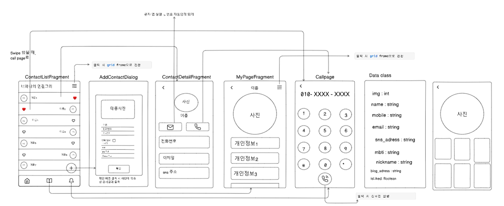
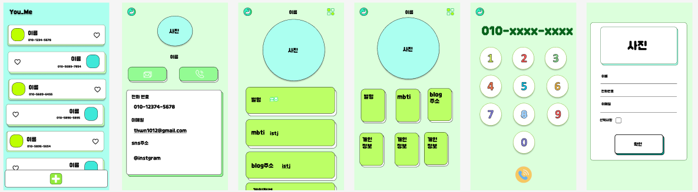

YOU & ME
===

   <h2>서로를 잇는 연결고리 전화 앱</h2>
   
내일배움캠프 7기 안드로이드 6조  
      팀 너와나의 연결고리 - YOU & ME

    

## 🔍 팀 소개 및 개요
팀 소개 - 코딩 랜드에 상륙하기 위해 온 5명!이 모였습니다!

개요 - 친구들의 연락처를 보여주고 마이페이지를 가진 앱을 만든다.
<table>
   <tr>
    <td align="center"></td>
      <td align="center"></td>
    <td align="center"></td>
      <td align="center"></td>
      <td align="center"></td>

   </tr>   
   <tr>
      <td align="center"><a href="https://github.com/hamham1210">박혜린</a> </td>
      <td align="center"><a href="https://github.com/cow-98">소준선</a></td>
      <td align="center"><a href="https://github.com/Kim-Min-Jong">김민종</a></td>
      <td align="center"><a href="https://github.com/sunho512">정선호</a></td>
      <td align="center"><a href="https://github.com/developShin">신승철</a></td>
   </tr>
      <tr>
      <td align="center">AddContactFragment </td>
      <td align="center">CallFragment</td>
      <td align="center">ContactListFragment</td>
      <td align="center">MyPageFragment</td>
      <td align="center">ContactDetailFragment</td>
   </tr>
</table>

## 🖥 와이어 프레임 및 디자인
  

## 🛠 사용 기술

       
       
       
       
        

## 🚩 주요 기능

    
ContactListFragment(MainActivity)

    
 
        &nbsp;&nbsp;&nbsp;&nbsp;1. 리사이클러뷰 사용하여서 연락처 리스트 보여주기  
        &nbsp;&nbsp;&nbsp;&nbsp;2 .연락처 리스트 클릭 시 디테일 페이지로   
        &nbsp;&nbsp;&nbsp;&nbsp;3. 하트 버튼 클릭시 핀 고정   
        &nbsp;&nbsp;&nbsp;&nbsp;4. 왼쪽 swipe 시 Callpage로 이동   
        &nbsp;&nbsp;&nbsp;&nbsp;5. TabLayout, ViewPager를 통해서 다른 페이지로 이동(Mypage, Callpage)   
        &nbsp;&nbsp;&nbsp;&nbsp;6. 플로팅버튼 누르면 AddContactDialogFragment 실행   
        &nbsp;&nbsp;&nbsp;&nbsp;7. 게시된 정보를 리사이클러뷰로 표시하여서  Grid/List 선택에 따라 itemViewType타입 변경 처리
    

    
AddContactDialogFragment

    
 
        &nbsp;&nbsp;&nbsp;&nbsp;1. 이름 , 전화번호, 이메일 정보 입력 받기. 
        &nbsp;&nbsp;&nbsp;&nbsp;2. 선택 입력 체크박스 클릭 시 추가 입력사항 표시하기. 
        &nbsp;&nbsp;&nbsp;&nbsp;3.스크롤 뷰를 하여서 선택 입력사항까지 보이게 하기. 
        &nbsp;&nbsp;&nbsp;&nbsp;4.확인 버튼 누르면 유효성 검사 실행하여 잘못된 값이 있는지 확인해준다. 
        &nbsp;&nbsp;&nbsp;&nbsp;5.유효성 검사를 통과하면, 확인버튼을 통해서 메인화면으로 이동한다. 
        &nbsp;&nbsp;&nbsp;&nbsp;6.사진 넣기 기능 추가
    

    
ContactDetailFragment

    
 
        &nbsp;&nbsp;&nbsp;&nbsp;1. 이름 , 전화번호, 이메일 정보 입력 받기. 
        &nbsp;&nbsp;&nbsp;&nbsp;2. 선택 입력 체크박스 클릭 시 추가 입력사항 표시하기. 
        &nbsp;&nbsp;&nbsp;&nbsp;3.스크롤 뷰를 하여서 선택 입력사항까지 보이게 하기. 
        &nbsp;&nbsp;&nbsp;&nbsp;4.확인 버튼 누르면 유효성 검사 실행하여 잘못된 값이 있는지 확인해준다. 
        &nbsp;&nbsp;&nbsp;&nbsp;5.유효성 검사를 통과하면, 확인버튼을 통해서 메인화면으로 이동한다. 
        &nbsp;&nbsp;&nbsp;&nbsp;6.사진 넣기 기능 추가
    

    
MyPageFragment

        
 
            &nbsp;&nbsp;&nbsp;&nbsp;1. 사용자의 사진, 닉네임, mbti, blog_address 의 정보등 게시 
            &nbsp;&nbsp;&nbsp;&nbsp;2. 메일, sns, 문자 아이콘 클릭 시 해당 행위를 할 수 있는 페이지로 이동 
            &nbsp;&nbsp;&nbsp;&nbsp;3. 웹뷰 인텐트를 통해 2번을 구현 
        

    
CallFragment

        
 
            &nbsp;&nbsp;&nbsp;&nbsp;1. ContactListFragment와 ContactDetailFragment의 전화번호 값을 가져와서 표시하기. 
            &nbsp;&nbsp;&nbsp;&nbsp;2. 전화 버튼을 클릭 시 해당 전화번호로 전화걸기. 
            &nbsp;&nbsp;&nbsp;&nbsp;3. 번호 입력시 특정 구간마다 '-' 붙여주기 
            &nbsp;&nbsp;&nbsp;&nbsp;4. 번호를 지울 수 있는 버튼 구현하기 
        

## ✅ 협업 관리
Github의 Project의 칸반 보드를 통해 Issue를 생성하고, 완료 된 Issue는 Pull Request와 연결하여 관리  
[Github-Project](https://github.com/orgs/Coding-landing/projects/1)
